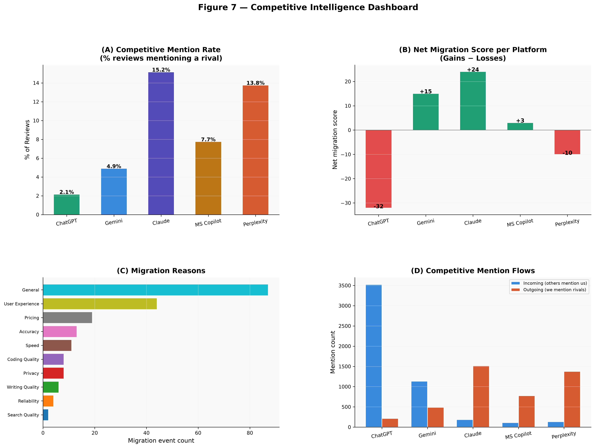
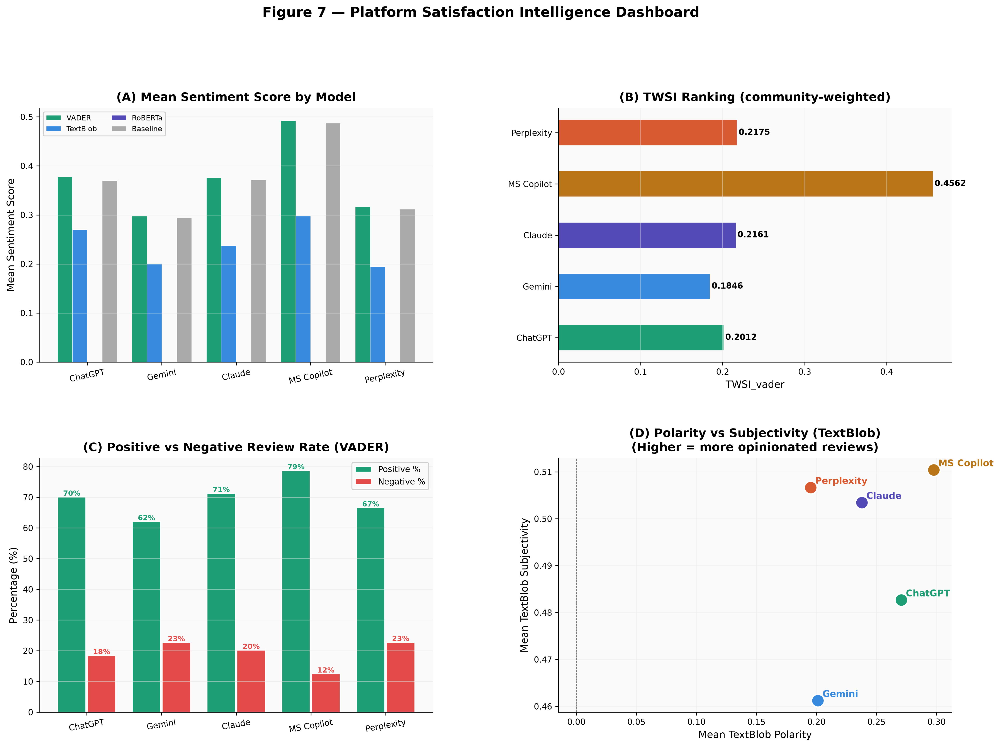
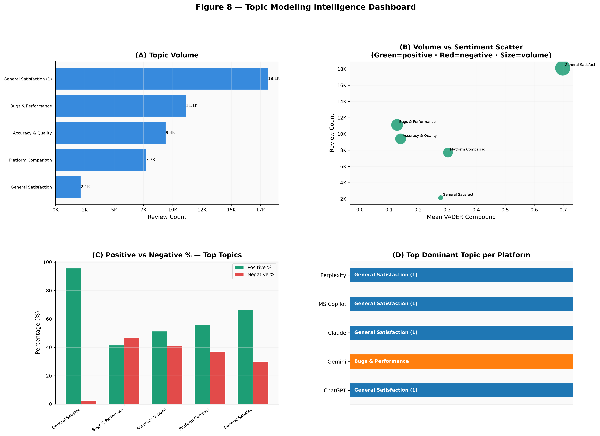
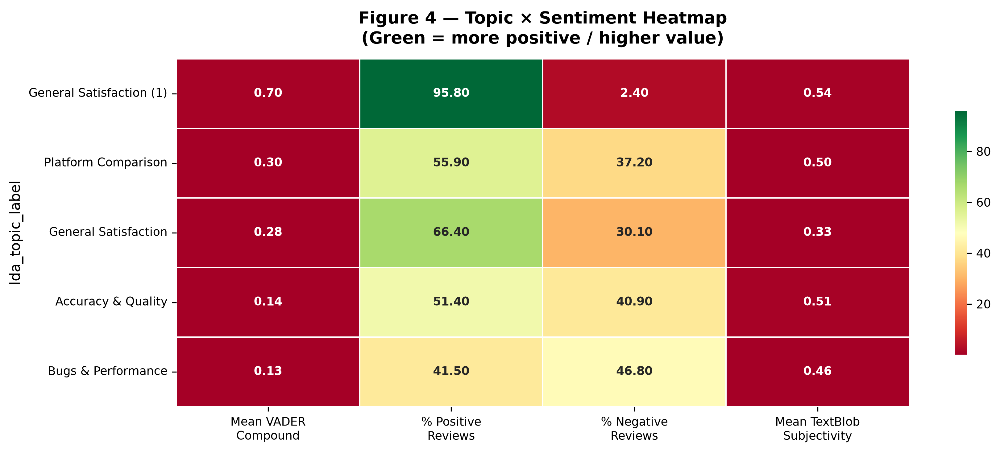
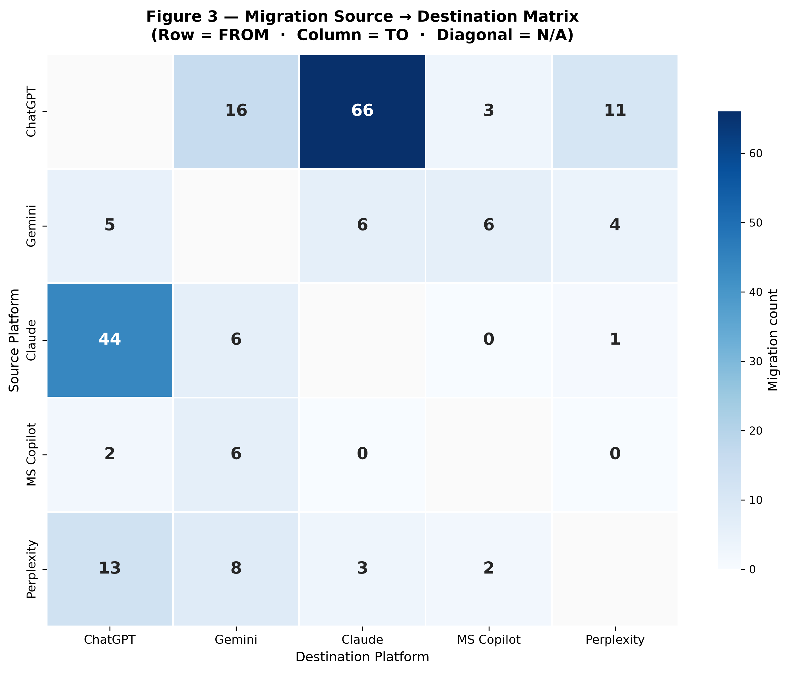
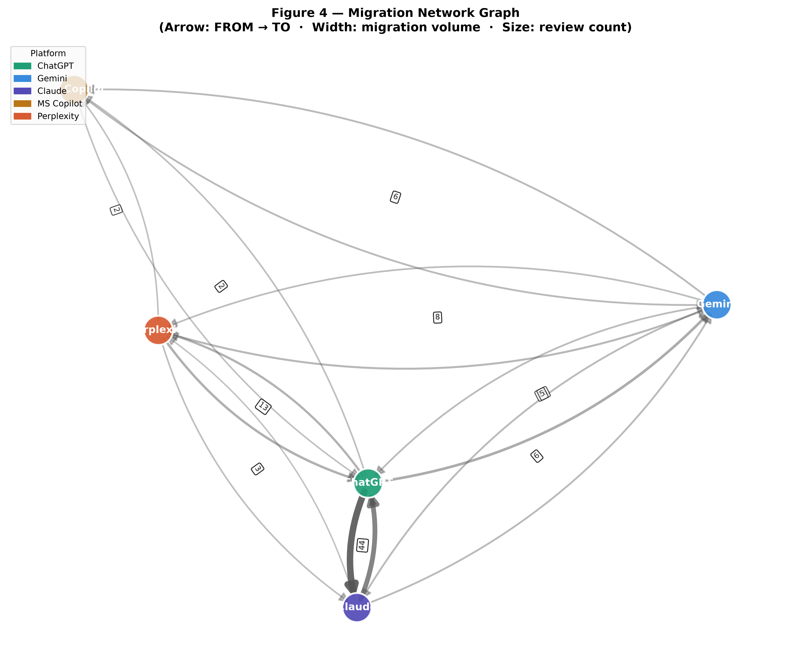

# 🚀 AI-Platform-Sentiment-and-Migration-Analysis

### Decoding User Satisfaction, Competitive Dynamics, and Platform Switching Behavior Across 50,000 AI Assistant Reviews

<p align="center">


</p>

---

> ### Built to answer one question:
>
> **If 50,000 users could collectively choose the best AI assistant, what would the data say?**

---

## 🌍 Project Overview

The Generative AI race is no longer defined solely by model benchmarks.

Millions of users interact with AI assistants daily, compare alternatives, switch platforms, praise strengths, and criticize weaknesses. Hidden inside those conversations are valuable signals about satisfaction, loyalty, competitive positioning, and user behavior.

This project analyzes **50,000 real-world reviews** across:

* 🤖 ChatGPT
* 💎 Gemini
* 🧠 Claude
* 🪟 Microsoft Copilot
* 🔍 Perplexity

Using a large-scale NLP and analytics pipeline, the project transforms user reviews into actionable intelligence through:

✅ Multi-Model Sentiment Analysis

✅ Community-Weighted Satisfaction Scoring

✅ LDA Topic Modeling

✅ BERTopic Semantic Analysis

✅ Competitive Intelligence Analytics

✅ User Migration Detection

✅ Interactive Dashboard Development

Rather than asking **"Is a review positive or negative?"**, this project asks:

* Which platform creates the happiest users?
* What drives dissatisfaction?
* Why do users switch platforms?
* Which competitors are gaining momentum?
* What topics dominate user conversations?
* How does community endorsement affect satisfaction?

---

# 📊 Executive Dashboard

<p align="center">

</p>

---

# 📚 Dataset

## The Generative AI Ecosystem — 50K User Reviews (2026)

**Dataset Source:** *(https://www.kaggle.com/datasets/jahnavikachhia23/the-generative-ai-ecosystem-50k-user-reviews-2026)*

### Dataset Statistics

| Metric               | Value  |
| -------------------- | ------ |
| Total Reviews        | 50,000 |
| Platforms            | 5      |
| Reviews per Platform | 10,000 |
| Original Features    | 10     |
| Engineered Features  | 60+    |
| Generated Figures    | 40+    |
| Dashboard Pages      | 5      |

---

## Platforms Included

| Platform          | Focus Area                            |
| ----------------- | ------------------------------------- |
| ChatGPT           | General-purpose AI assistant          |
| Gemini            | Google's multimodal AI ecosystem      |
| Claude            | Long-context reasoning and writing    |
| Microsoft Copilot | Productivity and enterprise workflows |
| Perplexity        | AI-powered search and retrieval       |

---

# 🎯 Research Questions

This project was designed around six major questions:

### 🏆 Which platform has the highest user satisfaction?

Measured through:

* VADER
* TextBlob
* Community-Weighted Sentiment (TWSI)

---

### 🧠 What are users actually talking about?

Explored through:

* LDA Topic Modeling
* BERTopic Semantic Clustering

---

### 😡 What drives negative experiences?

Investigated through:

* Topic-level sentiment analysis
* Complaint extraction

---

### 🔄 Why do users switch platforms?

Analyzed through:

* Migration signal detection
* Migration reason categorization

---

### 📈 Which platforms gain or lose users?

Measured using:

* Migration networks
* Net migration scores

---

### 🏢 What does the AI competitive landscape actually look like?

Explored through:

* Competitor mentions
* Cross-platform comparisons
* Competitive intelligence metrics

---

# 🏆 Key Findings

## 🥇 Satisfaction Leader — Microsoft Copilot

Across multiple metrics, Microsoft Copilot consistently achieved the strongest performance.

### Evidence

✔ Highest average sentiment

✔ Highest positive-review rate

✔ Highest community-weighted sentiment score

✔ Lowest proportion of strongly negative reviews

---

## 📈 Growth Leader — Claude

Migration analytics identified Claude as the strongest net gainer of users.

Users frequently cited:

* Better writing quality
* Improved reliability
* Strong reasoning capabilities
* Better overall experience

as reasons for switching.

---

## 🎯 Industry Benchmark — ChatGPT

ChatGPT received significantly more competitor references than any other platform.

This indicates that users often evaluate alternative AI assistants relative to ChatGPT, making it the ecosystem's benchmark platform.

---

## ⚠️ Biggest Pain Point — Bugs & Performance

Topic modeling revealed that the most negative discussions centered around:

* Technical issues
* Stability concerns
* Performance problems
* Reliability limitations

These factors generated stronger negative sentiment than pricing-related complaints.

---

## 🔄 Largest Competitive Battlefield

Migration analysis revealed the strongest movement between:

### ChatGPT ↔ Claude

This suggests direct competition for a similar user base and highlights one of the most active rivalries in the AI ecosystem.

---

# 📊 Key Insights at a Glance

| Finding                  | Insight            |
| ------------------------ | ------------------ |
| 🏆 Satisfaction Leader   | Microsoft Copilot  |
| 📈 Growth Leader         | Claude             |
| 🎯 Industry Benchmark    | ChatGPT            |
| ⚠️ Largest Pain Point    | Bugs & Performance |
| 🔄 Strongest Rivalry     | ChatGPT ↔ Claude   |
| 💡 Main Switching Driver | User Experience    |

---

# 📈 Competitive Intelligence Snapshot

<p align="center">

</p>

---

# 🧠 Topic Intelligence Snapshot

<p align="center">

</p>

---
# 🔬 Methodology & Analytical Framework

This project follows a multi-stage data science workflow that transforms raw user reviews into ecosystem-level intelligence.

<p align="center">

```text
50,000 Raw Reviews
        │
        ▼
Data Quality Audit
        │
        ▼
Text Cleaning & Feature Engineering
        │
        ▼
Multi-Model Sentiment Analysis
        │
        ▼
Topic Discovery (LDA + BERTopic)
        │
        ▼
Competitive Intelligence Analysis
        │
        ▼
Migration Detection Framework
        │
        ▼
Interactive Analytics Dashboard
```

</p>

---

# 😊 Sentiment Intelligence Framework

Most review-analysis projects rely on a single sentiment model.

This project combines multiple approaches to improve robustness and reduce model bias.

---

## VADER

Lexicon-based sentiment analysis optimized for short-form user-generated content.

Used for:

- Sentiment polarity
- Positive / Neutral / Negative classification
- Platform-level satisfaction comparisons

---

## TextBlob

Provides:

- Polarity scoring
- Subjectivity analysis

Used to validate findings from VADER.

---

## 🌟 TWSI — Thumbs-Weighted Sentiment Index

One of the project's core contributions.

Traditional sentiment analysis assumes every review has equal importance.

However, reviews receiving hundreds of community endorsements may better represent collective user opinion.

TWSI incorporates:

```text
Review Sentiment
+
Community Endorsement (Thumbs Up)
=
Weighted Satisfaction Score
```

This creates a more realistic measure of ecosystem-level satisfaction.

---

# 🧠 Topic Discovery Framework

Understanding sentiment alone is not enough.

A positive review does not explain *why* a user is satisfied.

A negative review does not explain *what* caused dissatisfaction.

To answer these questions, two complementary topic modeling approaches were used.

---

## LDA (Latent Dirichlet Allocation)

Used to discover interpretable discussion themes.

The optimal topic count was selected through coherence optimization.

### Major Topics Identified

- General Satisfaction
- Accuracy & Quality
- Bugs & Performance
- Platform Comparison
- User Experience

---

## BERTopic

Used transformer-based semantic embeddings to identify higher-level conversation clusters and hidden discussion patterns.

BERTopic enables deeper understanding of user concerns beyond keyword frequency.

---

# 🧠 Topic Sentiment Intelligence

<p align="center">

</p>

### Major Finding

The most negative discussions were concentrated around:

⚠️ Bugs & Performance

⚠️ Accuracy & Quality

while

✅ General Satisfaction

generated overwhelmingly positive sentiment.

---

# 🔄 Migration Intelligence Framework

Most sentiment projects stop after classifying reviews.

This project goes further.

A custom migration detection pipeline was designed to identify when users describe switching between AI assistants.

---

## Example Migration Signals

```text
"I switched from ChatGPT to Claude."

"Moved from Gemini because of accuracy issues."

"Using Perplexity instead of Copilot."
```

---

## Migration Pipeline

```text
Platform Mention Detection
           │
           ▼
Migration Signal Identification
           │
           ▼
Source Platform Extraction
           │
           ▼
Destination Platform Extraction
           │
           ▼
Migration Reason Classification
```

---

## Migration Categories

The framework identifies migration driven by:

- Accuracy
- Pricing
- User Experience
- Reliability
- Writing Quality
- Coding Quality
- Search Quality
- Privacy
- Speed
- General Preference

---

# 🔄 Migration Matrix

<p align="center">

</p>

### Key Insight

The strongest migration flows occurred between:

### 🔥 ChatGPT ↔ Claude

highlighting one of the most competitive relationships within the AI ecosystem.

---

# 🌐 Migration Network Graph

<p align="center">

</p>

Network analysis reveals:

- Platform influence
- User movement patterns
- Competitive relationships
- Net migration gains and losses

---

# 📊 Interactive Dashboard

The project includes a fully interactive Streamlit dashboard for exploring insights in real time.

---

## 🏠 Executive Overview

- KPI Cards
- Platform Rankings
- Ecosystem Summary

---

## 😊 Sentiment Intelligence

- VADER Analysis
- TextBlob Analysis
- TWSI Rankings
- Sentiment Comparisons

---

## 🧠 Topic Intelligence

- Topic Frequencies
- Topic Heatmaps
- Topic Rankings
- Platform-Topic Analysis

---

## 🔄 Migration Intelligence

- Migration Matrix
- Migration Network
- Switching Reasons
- Net Migration Scores

---

## 📂 Data Explorer

- Search
- Filtering
- Export Functionality

---

# 🛠️ Technology Stack

## Data Science

- Python
- Pandas
- NumPy

---

## Machine Learning & NLP

- Scikit-Learn
- VADER
- TextBlob
- Gensim
- BERTopic
- Sentence Transformers

---

## Visualization

- Plotly
- Matplotlib
- Seaborn

---

## Dashboard Development

- Streamlit

---

## Network Analytics

- NetworkX

---

# 📂 Repository Structure

```text
AI-Platform-Sentiment-and-Migration-Analysis
│
├── data/
│   ├── raw/
│   └── processed/
│
├── notebooks/
│   ├── 01_eda.ipynb
│   ├── 02_preprocessing.ipynb
│   ├── 03_sentiment_analysis.ipynb
│   ├── 04_topic_modeling.ipynb
│   └── 05_migration_analysis.ipynb
│
├── dashboard/
│   ├── app.py
│   ├── pages/
│   └── utils/
│
├── outputs/
│   └── figures/
│
├── requirements.txt
├── README.md
└── .gitignore
```

---

# 🌟 What Makes This Project Different?

Most sentiment analysis projects stop at:

✔ Positive vs Negative Reviews

This project goes significantly further.

### Additional Intelligence Layers

✅ Community-Weighted Satisfaction Scoring

✅ Topic Discovery & User Voice Analysis

✅ Competitive Intelligence Analytics

✅ Migration Behavior Detection

✅ Platform Switching Analysis

✅ Ecosystem-Level Market Insights

✅ Interactive Decision-Making Dashboard

---

# 📈 Business & Research Value

This project demonstrates how large-scale user feedback can be transformed into:

- Product Intelligence
- Competitive Intelligence
- User Behavior Analytics
- Market Research Insights
- Decision-Support Dashboards

The same methodology can be applied to:

- SaaS Platforms
- Mobile Applications
- E-commerce Products
- Streaming Services
- FinTech Applications
- Enterprise Software

---

# 👩‍💻 Author

## Hifza Amir

**B.Tech CSE (Data Science)**

### Areas of Interest

- Data Science
- Machine Learning
- Natural Language Processing
- Explainable AI
- Predictive Analytics
- User Behavior Analysis
- AI Research

### Connect With Me

- LinkedIn: *(https://www.linkedin.com/in/hiifzza/)*
- GitHub: *(https://github.com/hiifza)*

---

# ⭐ Support The Project

If you found this project interesting, insightful, or useful:

### ⭐ Star the repository

### 🍴 Fork the project

### 💡 Share feedback and suggestions

---

<p align="center">

### From 50,000 Reviews to Ecosystem Intelligence 🚀

*Understanding how users evaluate, compare, and migrate between the world's leading AI assistants.*

</p>
